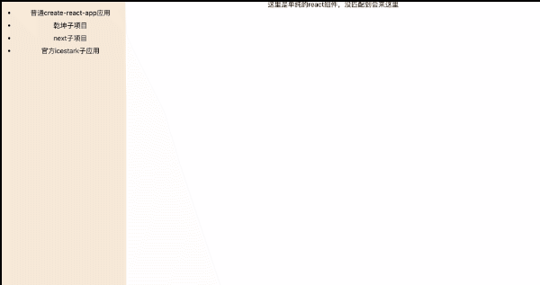

# medusa

> (M)ircrofront(E)n(D) (U)niversal(S)inglepage(A)pplication.

English｜[简体中文](./README_zh.md)｜

Medusa is a micro front-end framework based on various frameworks. It has extremely high framework compatibility and can run on several mainstream micro front-end frameworks. It enables `Qiankun`, `Icestark`, `@micro-zoe/micro-app` and `next.js` to run in one environment at the same time. And all use the `proxy` as sandbox solution, ignore the compatibility problem of old browsers, and completely isolate the main application and the micro application.

# Feature

1. Unrestricted front-end framework.

2. Compatible with Qiankun, Icestark, Jingdong and other micro front-end frameworks, and can be loaded directly without any changes.

3. Support the direct use of SSR mode.

4. Support loading the popular SSR framework next.js.

5. Can be used as an independent micro front-end framework

6. Take the life cycle of React components as the life cycle of micro-applications

# Getting Start

For more usage, please see [Examples](./examples)

## Base Application

> The Base Application muse be React

1. Install

```shell
$ yarn add @tuya-fe/medusa 
```

2. import at the router

```tsx

import {Router, Route} from '@tuya-fe/medusa'

const App = () => {
  return <Router loading={<div>loading...</div>}>
    <Route html="http://localhost:7100" appId="reactApp" />
  </Router>
}

ReactDOM.render(<App />, document.getElementById('app'))

```

## Micro Application

> We take the dev mode as an example.

1. Just set cross-domain for webpack-dev-server

```js
devServer: {
  headers: {
    'Access-Control-Allow-Origin': '*'
  }
}

```

# Examples

Inside the examples folder, there is a Base Application with three Micro FE apps. It also shows how to load the micro front-end in 8 different ways. 


```shell
git clone https://github.com/medusa.git
cd medusa
```

```shell

yarn demo

```



# License
[MIT](./LICENSE)
