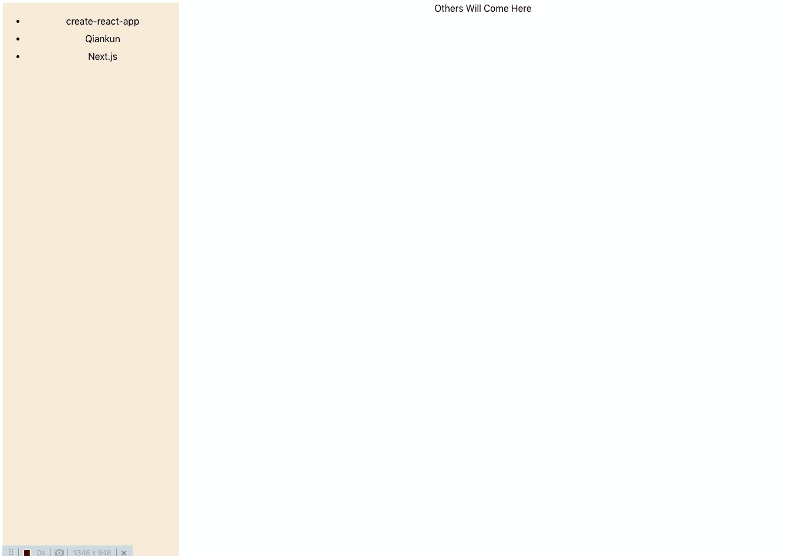

## Medusa

> (M)ircrofront(E)n(D) (U)niversal (S)inglepage (A)pplication. [Chinese Docs](https://tuya.github.io/medusa/)

English | [简体中文](./README_zh.md)

Medusa is a micro frontend framework based on various frameworks. With extremely high framework compatibility, Medusa can run on several popular micro front-end frameworks. It enables [Qiankun](https://github.com/umijs/qiankun), [Icestark](https://github.com/ice-lab/icestark), [micro-zoe/micro-app](https://github.com/micro-zoe/micro-app), and [Next.js](https://github.com/vercel/next.js) to run in one environment simultaneously. The `proxy` sandbox solution is used to solve compatibility problems of old browsers. The main application and the micro-application are completed isolated.

## Features

- Unrestricted frontend framework.

- Compatible with Qiankun, Icestark, micro-zoe/micro-app, and other micro frontend frameworks. It can be loaded directly without any changes.

- Directly use the server-side rendering mode.

- Load the popular server-side rendering framework Next.js.

- Be used as an independent micro frontend framework.

- Take the life cycle of React components as the life cycle of micro-applications.


## Get started

For more information, see [Examples](./examples).

### Main application

The main application is React.

1. Install dependency

    ```shell
    $ yarn add mmed
    ```

2. Import the main application

    ```tsx

    import {Router, Route} from 'mmed'

    const App = () => {
      return <Router loading={<div>loading...</div>}>
        <Route html="http://localhost:7100" appId="reactApp" />
      </Router>
    }

    ReactDOM.render(<App />, document.getElementById('app'))

    ```

### Micro-applications

Take the development mode as an example. Set the cross-origin parameter of the page.

```js
devServer: {
  headers: {
    'Access-Control-Allow-Origin': '*'
  }
}

```

## Example

In the `examples` directory, there are examples of the main application and three sub-applications. It also shows how to load the micro frontend in 8 ways in the main application.


```shell
git clone https://github.com/tuya/medusa.git
cd medusa
```

```shell

yarn demo

```



## License
For more information about licenses, see [MIT](./LICENSE).